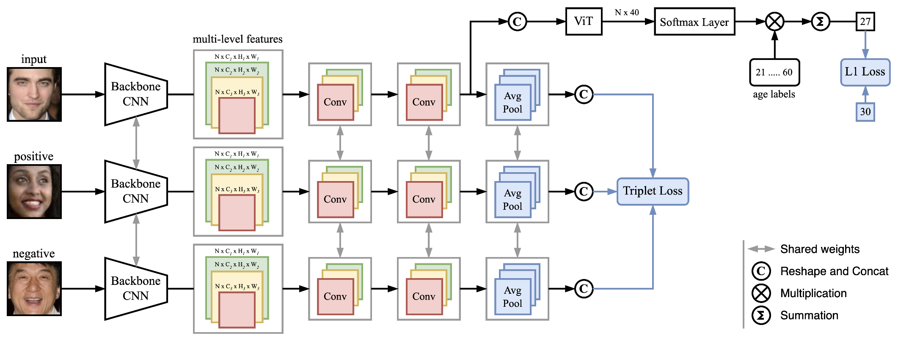

# Multi-Scale Similarity Learning for Facial Age Estimation

This is the Pytorch implementation of the ICCAS 2023 paper, "[Multi-scale Similarity Learning for Age Estimation based on Facial Images](https://ieeexplore.ieee.org/document/10316890)".

<p align="center">
    
</p>

---

## Datasets
- [UTKFace](https://susanqq.github.io/UTKFace/)
- [CACD](https://bcsiriuschen.github.io/CARC/)

The folder `datalists` contains `.csv` files for separate datasets. The folder structure used for implementation:
```
./datalists/
    CACD/
        test.csv
        train.csv
        val.csv
        images/
            14_Aaron_Johnson_0001.jpg
            14_Aaron_Johnson_0002.jpg
            ...
    UTKFace/
        test.csv
        train.csv
        val.csv
        images/ 
            1_0_0_20161219140623097.jpg
            1_0_0_20161219140627985.jpg
            ...
```
You can put images under corresponding `UTKFace` and `CACD` folders or use your own paths to datasets. See in [Evaluation and Training](#evaluation-and-training).


## Dependencies 
- Python 3
- Pytorch


## Preprocessing
- UTKFace. We use the aligned and cropped version of dataset.
- CACD. We use the implementation of MTCNN by [urbaneman](https://github.com/urbaneman/Face_crop_align_mtcnn) to crop and align images.


## Pretrained Models
The backbone we use is IR50, pre-trained on MS-Celeb-1M Dataset and modified by [Talented-Q](https://github.com/Talented-Q/POSTER_V2). You need to put the pretrained model under `pretrained_models` folder.
```
./pretrained_models/ir50.pth
```


## Trained Models
The trained models for UTKFace and CACD datasets can be downloaded [here](https://drive.google.com/drive/folders/1lAF4bkE7U6dpUmkdhqUV1Tw6LCbbbNgD?usp=sharing). 

In order to evaluate the trained models you can put them under `trained_models` folder or use your own paths to the models. See in [Evaluation and Training](#evaluation-and-training).


## Evaluation and Training 
In `opt.py` file, you can configure the dataset type, the paths to images and trained model, the path to save the new checkpoints for model and other hyperparameters. Besides, you can configure the arguments explicitly in command line before running. 
### Testing
You can test the trained model on UTKFace dataset by running:
```
python Main.py --phase test --data_type utk --data_path [path/to/utk/images/ or ./datalists/UTKFace/images/] --model_path [path/to/trained/model or ./trained_models/utk.pt]
```
You can test the trained model on CACD dataset by running:
```
python Main.py --phase test --data_type cacd --data_path [path/to/cacd/images/ or ./datalists/CACD/images/] --model_path [path/to/trained/model or ./trained_models/cacd.pt]
```
### Training and Validation
You can train and validate the model on UTKFace dataset by running:
```
python Main.py --phase train --data_type utk --data_path [path/to/utk/images/ or ./datalists/UTKFace/images/] --checkpoint_path path/to/save/checkpoints
```
You can train and validate the model on CACD dataset by running:
```
python Main.py --phase train --data_type cacd --data_path [path/to/cacd/images/ or ./datalists/CACD/images/] --checkpoint_path path/to/save/checkpoints --batch 64 --epochs 20 --seed 123 
```
## Citing
If you find this work useful, please cite the following paper:
```bibtex
@INPROCEEDINGS{10316890,
   author = {Amirullaeva, Sevara and Han, Ji-Hyeong},
   booktitle={2023 23rd International Conference on Control, Automation and Systems (ICCAS)}, 
   title = {Multi-Scale Similarity Learning for Age Estimation Based on Facial Images},
   year = {2023},
   pages={1874-1878},
   doi={10.23919/ICCAS59377.2023.10316890}
}
```


